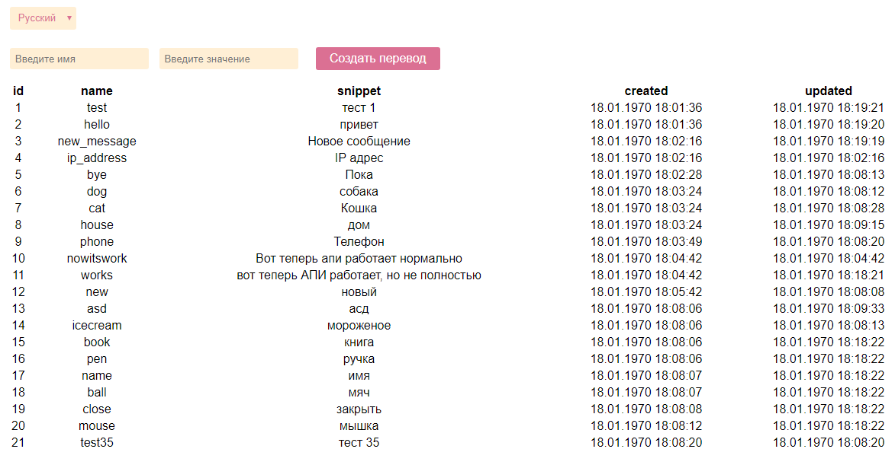

### Задание

В результате мы ожидаем увидеть одностраничное приложение, реализованное на одном из современных клиент-сайд фреймворков (Vue / React / Backbone).

UX на усмотрения соискателя, но мы видим это примерно так:

- Есть кнопка с переключением языков, в один момент времени показываются данные только для одного языка.
- На всю страницу грид для translates с колонками: id, name, snippet, created, updated.
- Есть кнопка "создать перевод" => в модальном окне или прямо на странице спрашиваем параметры name и snippet => создаем запись с текущим языком.
- У каждой записи в гриде есть возможность отредактировать прямо на месте или в отдельном модальном окне поле snippet.
- Необходимо слушать EventSource и на каждое событие в канале translations обновлять / добавлять соответствующие записи в грид.

Тестовый пользователь, где нужна авторизация: **test123:supersecret**

### Скриншоты

